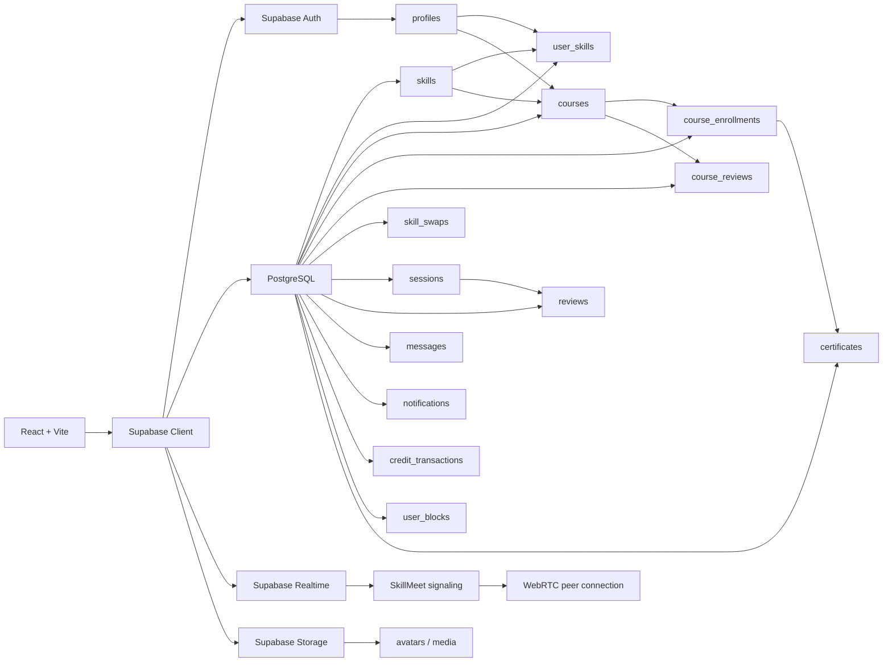

<div align="center">


<br />

# SkillSwap+

### Learn what you need. Teach what you know. Swap skills. Grow together.

[](https://react.dev/)
[](https://vite.dev/)
[](https://tailwindcss.com/)
[](https://supabase.com/)
[](https://www.postgresql.org/)
[](https://webrtc.org/)

**SkillSwap+ is a peer-to-peer learning platform that combines skill discovery, mentorship, structured courses, reciprocal skill exchange, messaging, live video sessions, reviews, certificates and an internal SS credit economy in one system.**

**Project status: 100% implementation complete and tested.**

</div>

---

## 01 · The idea

Most learning platforms follow one direction:

> **Instructor → Student**

SkillSwap+ changes that into a network:

> **Learn ↔ Teach ↔ Swap ↔ Earn ↔ Grow**

A member can learn one skill, teach another, discover courses, request mentorship, exchange skills directly, communicate through messaging, attend live SkillMeet sessions, earn or spend SS credits, receive certificates and build a visible history of learning and contribution.

---

## 02 · User roles

### 🎓 Learner
- Discover skills and people
- Search and join courses
- Request mentorship
- Attend SkillMeet sessions
- Spend SS credits
- Complete courses
- Receive certificates
- Review completed courses
- Review mentors after completed mentorship sessions
- Track history, messages and notifications

### 🧑‍🏫 Mentor
- Add teaching skills
- Create and manage courses
- Review enrollment requests
- Receive mentorship requests
- Schedule mentorship sessions
- Conduct SkillMeet sessions
- Earn SS credits
- Receive learner reviews
- Build teaching history and reputation

### ⚡ Swap Master
- Maintain learning and teaching skills
- Create and join courses
- Find reciprocal skill matches
- Exchange skills directly
- Conduct or join SkillMeet sessions
- Earn and spend SS credits
- Use the complete SkillSwap+ ecosystem

---

## 03 · Complete platform flow

```text
SIGN UP / LOGIN
      │
      ▼
PROFILE SETUP
      │
      ├── Learner ─────────► Learning Skills
      ├── Mentor ──────────► Teaching Skills
      └── Swap Master ─────► Learning + Teaching
                               │
                               ▼
                            DASHBOARD
                               │
              ┌────────────────┼────────────────┐
              ▼                ▼                ▼
           SEARCH            COURSES           SWAPS
              │                │                │
              ▼                ▼                ▼
      Skills / Profiles    Enrollment       Match / Request
              │                │                │
              └──────────┬─────┴──────┬─────────┘
                         ▼            ▼
                    MESSAGES       SESSIONS
                         │            │
                         └──────┬─────┘
                                ▼
                            SKILLMEET
                                │
                   ┌────────────┼────────────┐
                   ▼            ▼            ▼
                REVIEWS     CERTIFICATES   HISTORY
                                │
                                ▼
                           SS CREDIT FLOW
```

---

## 04 · Final project status

| Feature | Status |
|---|:---:|
| Email/password authentication | ✅ |
| Google login for existing users | ✅ |
| Password recovery | ✅ |
| Profile setup | ✅ |
| Edit profile | ✅ |
| Public profiles | ✅ |
| Avatar uploads | ✅ |
| Learner / Mentor / Swap Master roles | ✅ |
| Teaching / learning skills | ✅ |
| Role-based dashboard | ✅ |
| Skill search | ✅ |
| Profile search | ✅ |
| Skill → related course discovery | ✅ |
| Course creation | ✅ |
| Course discovery | ✅ |
| Course details | ✅ |
| Course management | ✅ |
| Enrollment requests | ✅ |
| My Courses | ✅ |
| Course modules / lectures / notes | ✅ |
| Course learning flow | ✅ |
| Course completion workflow | ✅ |
| Course reviews | ✅ |
| Mentorship requests | ✅ |
| Mentorship scheduling | ✅ |
| Mentor reviews | ✅ |
| Skill swaps | ✅ |
| Swap sessions | ✅ |
| Sessions / upcoming sessions | ✅ |
| Messaging | ✅ |
| Message replies | ✅ |
| Unread message count | ✅ |
| Block / unblock | ✅ |
| Notifications | ✅ |
| SkillMeet video calling | ✅ |
| Camera / microphone controls | ✅ |
| Screen sharing | ✅ |
| TURN fallback for WebRTC | ✅ |
| Certificates | ✅ |
| Certificate verification | ✅ |
| Activity / history tracking | ✅ |
| SS credit economy | ✅ |
| Row Level Security | ✅ |

**Implementation completion: 100%**

---

## 05 · Authentication and identity

SkillSwap+ uses Supabase Authentication for user identity and session handling.

Supported flows:
- Email/password registration
- Email/password login
- Google login for existing SkillSwap+ users
- Password reset
- Auth callback handling
- Profile-completion routing
- Active/inactive account checks
- Role-aware application access

Google authentication is used as a **login-only flow for existing SkillSwap+ accounts**. New registration remains email/password based.

---

## 06 · Profiles and skills

Profiles are the identity layer of the platform.

Users can maintain:
- Full name
- Username
- Avatar
- Bio
- Location
- Career goal
- Role
- Learning skills
- Teaching skills

Public profiles show relevant member information, skill areas and mentor reputation. Mentor and Swap Master profiles can also display mentorship ratings and reviews.

---

## 07 · Search and discovery

### Profile setup search
`SkillSearch.jsx` is used when selecting learning and teaching skills.

### Dashboard search
`SearchSkillsProfiles.jsx` searches both skills and public profiles.

```text
Search
  │
  ├── Skill ─────► SkillMatch ─────► Related Courses
  │
  └── Profile ───► Public Profile
```

### SkillMatch
Selected skills open:

```text
/skill-match/:skillId
```

---

## 08 · Course ecosystem

Mentors and Swap Masters can create and manage structured courses.

Course capabilities:
- Course creation
- Skill association
- Course level
- SS credit price
- Course discovery
- Course details
- Modules
- Lectures
- Notes
- Quizzes
- Assignments
- Enrollment requests
- Instructor approval
- Learning workspace
- Completion requests
- Final completion
- Certificates
- Course reviews

### Course learning flow

```text
Course Discovery
      │
      ▼
Course Details
      │
      ▼
Enrollment Request
      │
      ▼
Instructor Approval
      │
      ▼
SS Credit Transfer
      │
      ▼
My Courses
      │
      ▼
Course Learning
      │
      ▼
Completion Request
      │
      ▼
Instructor Completion
      │
      ├──► Certificate
      └──► Course Review
```

---

## 09 · Course reviews

Learners can review courses only after completing them.

Rules:
- Only completed learners can create a review
- One active review per learner per course
- Rating range: **1–5**
- Optional written comment
- Learners can delete their own review at any time
- After deletion, they can submit a new review
- Reviews appear on the Course Details page
- Average rating and review count are displayed

Database-level uniqueness prevents duplicate active reviews:

```text
UNIQUE(course_id, reviewer_id)
```

---

## 10 · Mentorship

```text
Learner
   │
   ▼
Public Mentor Profile
   │
   ▼
Mentorship Request
   │
   ▼
Mentor Accepts
   │
   ▼
Schedule Session
   │
   ▼
SkillMeet
   │
   ▼
Session Completion
   │
   ▼
Learner Reviews Mentor
```

Mentorship sessions use **SkillMeet only**.

---

## 11 · Mentor reviews

Mentor reviews are tied to completed mentorship sessions.

Rules:
- Only the learner from the completed mentorship session can review the mentor
- Rating range: **1–5**
- Optional comment
- Duplicate reviews for the same session are blocked
- Mentors can see reviews they received
- Visitors to public mentor profiles can see public mentor ratings and reviews
- Public review access is exposed through a safer RPC
- Swap sessions do not use this mentorship review flow

---

## 12 · Skill swaps

SkillSwap+ supports reciprocal peer-to-peer skill exchange.

```text
USER A: Teaches React / Wants UI-UX
             ↕
USER B: Teaches UI-UX / Wants React
             │
             ▼
        SWAP REQUEST
             │
             ▼
          SESSION
             │
             ▼
          SKILLMEET
             │
             ▼
         COMPLETION
```

---

## 13 · SkillMeet

SkillMeet is the built-in one-to-one video meeting system inside SkillSwap+.

Capabilities:
- Authenticated participant access
- Session-level authorization
- Mentorship session support
- Swap session support
- One-to-one WebRTC video calling
- Camera control
- Microphone control
- Screen sharing
- Supabase Realtime signaling
- Presence tracking
- ICE candidate trickling
- Reconnection / ICE restart handling
- STUN discovery
- TURN relay fallback
- Join / leave handling
- Participant and connection status
- Modern meeting interface

```text
SkillSwap Session
       │
       ▼
 /skillmeet/:type/:id
       │
       ▼
Supabase Realtime
       │
       ▼
WebRTC Negotiation
       │
       ├── STUN
       └── TURN fallback
       │
       ▼
 Live SkillMeet Call
```

---

## 14 · Messaging

Messaging features:
- Conversation list
- Direct conversations
- User search
- Start new conversation
- Message replies
- Unread message count
- Conversation history
- Read tracking
- Server-side message RPCs
- Message length validation
- Block / unblock support

```text
User A blocks User B
        │
        ├── New messages blocked
        ├── New conversation blocked
        └── Existing conversation history preserved
```

---

## 15 · Notifications

Notifications cover:
- Enrollment updates
- Course activity
- Credit activity
- Mentorship updates
- Swap updates
- Session updates
- Other account events

Unread notification and message counts can be surfaced in the dashboard header.

---

## 16 · SS credit economy

**SS** is the internal SkillSwap+ credit unit.

```text
Learner       ── SS ──► Mentor
Learner       ── SS ──► Swap Master
Swap Master   ── SS ──► Mentor
Swap Master   ── SS ──► Swap Master
```

Credits are controlled through backend operations rather than arbitrary client-side balance updates.

SS is used for:
- Course enrollment
- Mentorship
- Skill exchange rewards
- Internal learning transactions

---

## 17 · Certificates

```text
Course Completion
      │
      ▼
Certificate Issued
      │
      ▼
Verification Code
      │
      ▼
Public Verification Route
```

---

## 18 · Activity and history

The system records important activity related to courses, credits, sessions, swaps, mentorship, certificates and other key platform events.

---

## 19 · Architecture



---

## 20 · Technology stack

### Frontend
- React 19
- Vite
- Tailwind CSS
- React Router
- Lucide React

### Backend
- Supabase Auth
- PostgreSQL
- PostgreSQL RPC functions
- Row Level Security
- Supabase Realtime
- Supabase Storage

### Real-time communication
- WebRTC
- Supabase Realtime signaling
- STUN
- TURN

### Deployment
- Netlify / Vercel compatible

---

## 21 · Database areas

| Domain | Main tables |
|---|---|
| Identity | `profiles` |
| Settings | `user_settings` |
| Skills | `skills`, `skill_categories`, `user_skills`, `user_interests` |
| Courses | `courses`, `course_modules`, `course_lectures`, `course_notes`, `course_quizzes`, `course_assignments` |
| Enrollments | `course_enrollments`, `course_completion_requests` |
| Course reviews | `course_reviews` |
| Credits | `credit_transactions` |
| Swaps | `skill_swaps`, swap session records |
| Mentorship / sessions | `sessions`, mentorship-related records |
| Mentor reviews | `reviews` |
| Messaging | `conversations`, `conversation_members`, `messages` |
| Blocking | `user_blocks` |
| Certificates | `certificates` |
| History | `activity_logs` |
| Notifications | `notifications` |
| Media | Supabase Storage-backed media |

---

## 22 · Security model

SkillSwap+ uses Supabase Row Level Security and PostgreSQL functions for sensitive operations.

```text
✓ Users update only permitted profile data
✓ Skill selections are user-scoped
✓ Conversation access requires membership
✓ Message sending is validated server-side
✓ Block rules restrict communication
✓ Credit operations are handled server-side
✓ Course actions are permission-aware
✓ Enrollment actions are permission-aware
✓ Only completed learners can review courses
✓ Course-review duplication is blocked
✓ Only eligible learners can review completed mentorship sessions
✓ SkillMeet access is tied to real session participants
✓ Certificates are tied to completed course records
```

---

## 23 · Local setup

```bash
git clone <your-repository-url>
cd <your-project-folder>
npm install
```

Create `.env`:

```env
VITE_SUPABASE_URL=your_supabase_project_url
VITE_SUPABASE_PUBLISHABLE_KEY=your_supabase_publishable_key

VITE_TURN_URL=turn:your-turn-server:3478?transport=udp,turn:your-turn-server:3478?transport=tcp,turns:your-turn-server:5349?transport=tcp
VITE_TURN_USERNAME=your_turn_username
VITE_TURN_CREDENTIAL=your_turn_credential

VITE_FORCE_TURN=false
```

Run:

```bash
npm run dev
```

Default URL:

```text
http://localhost:5173
```

---

## 24 · OAuth redirect setup

Local:

```text
http://localhost:5173/auth/callback
```

Production:

```text
https://your-domain.com/auth/callback
```

OAuth redirect:

```js
redirectTo: `${window.location.origin}/auth/callback`
```

---

## 25 · SkillMeet network configuration

For reliable calls across different networks, SkillMeet uses TURN fallback in addition to STUN.

```env
VITE_TURN_URL=turn:host:3478?transport=udp,turn:host:3478?transport=tcp,turns:host:5349?transport=tcp
VITE_TURN_USERNAME=username
VITE_TURN_CREDENTIAL=password
```

`VITE_FORCE_TURN=true` can be used temporarily for TURN diagnostics.

**Do not commit real TURN credentials.**

---

## 26 · Project structure

```text
src/
├── components/
│   ├── DashboardHeader.jsx
│   ├── DashboardCourses.jsx
│   ├── SkillSearch.jsx
│   ├── SearchSkillsProfiles.jsx
│   ├── EditProfileHeader.jsx
│   ├── ProfileEditTab.jsx
│   ├── TeachingEditTab.jsx
│   ├── LearningEditTab.jsx
│   ├── PreferencesEditTab.jsx
│   └── SessionReviewModal.jsx
│
├── pages/
│   ├── Dashboard.jsx
│   ├── PublicProfile.jsx
│   ├── EditProfile.jsx
│   ├── SkillMatch.jsx
│   ├── Courses.jsx
│   ├── CourseDetails.jsx
│   ├── CourseCreation.jsx
│   ├── CourseManage.jsx
│   ├── CourseLearn.jsx
│   ├── EnrollmentRequests.jsx
│   ├── MyCourses.jsx
│   ├── Messages.jsx
│   ├── Swaps.jsx
│   ├── MentorshipRequests.jsx
│   ├── Sessions.jsx
│   ├── UpcomingSessions.jsx
│   ├── SkillMeet.jsx
│   ├── Certificate.jsx
│   ├── CertificateVerify.jsx
│   └── History.jsx
│
└── lib/
    ├── supabase.js
    └── activityLog.js
```

---

## 27 · Design language

| Token | Value |
|---|---|
| Background | `#060807` |
| Surface | `#0A0D0B` |
| Primary text | `#F2F4EF` |
| Secondary text | `#A1A1AA` |
| Accent | `#C7FF39` |

**Direction:** dark · modern · minimal · sharp typography · thin borders · subtle glow · high contrast · responsive

---

## 28 · Completed end-to-end journeys

### Course
```text
Discover → Details → Request Enrollment → Approval → SS Transfer
→ Learn → Completion → Certificate → Review
```

### Mentorship
```text
Discover Mentor → Public Profile → Request → Accept → Schedule
→ SkillMeet → Complete → Review Mentor
```

### Swap
```text
Find Match → Create / Accept Swap → Schedule → SkillMeet → Complete
```

### Communication
```text
Find Member → Conversation → Message / Reply → Read Tracking
→ Notifications → Optional Block / Unblock
```

---

## 29 · Future implementation ideas

The Software Lab implementation is complete. These are future extensions, not unfinished core features.

### Intelligent discovery
- Personalized skill recommendations
- AI-assisted mentor matching
- Better reciprocal swap ranking
- Recommendation scoring based on interests, history and goals

### Learning intelligence
- Personalized learning roadmaps
- Automated progress insights
- Skill-gap analysis
- Suggested next courses

### Community
- Skill challenges
- Group learning rooms
- Community posts
- Public achievements and badges
- Skill endorsements

### SkillMeet
- Group video rooms
- In-call chat
- Collaborative whiteboard
- Session recording with consent
- Live captions
- Calendar integration

### Course expansion
- Richer quiz engine
- Assignment submissions
- Automated grading for supported question types
- Course analytics
- Learning streaks and progress dashboards

### Platform expansion
- Administrative analytics
- Moderation tooling
- Mobile application
- Push notifications
- Multi-language support

---

## 30 · Project completion

SkillSwap+ has reached the final implementation stage for the Software Lab project.

The completed platform combines:

```text
AUTHENTICATION
+ PROFILES & ROLES
+ SKILL DISCOVERY
+ COURSES
+ MENTORSHIP
+ SKILL SWAPS
+ MESSAGING
+ NOTIFICATIONS
+ SS CREDITS
+ SKILLMEET
+ REVIEWS
+ CERTIFICATES
+ HISTORY
```

The system has been integrated and tested as a connected product rather than a collection of isolated pages.

---

## 31 · Vision

> **Knowledge becomes more valuable when people can exchange it directly.**

A user does not need to be only a student or only an instructor. They can be both.

<div align="center">

### Built around one simple idea

## **What you know can help someone. What they know can help you.**

### SkillSwap+

`LEARN  /  TEACH  /  SWAP  /  GROW`

**Software Lab Project — Final Implementation Complete**

</div>
