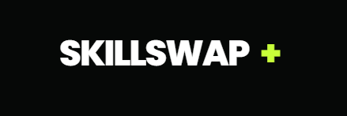
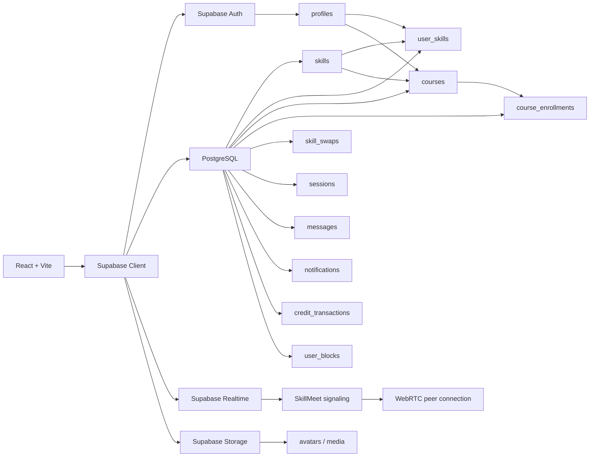

<div align="center">



<br />

# SkillSwap+

### Learn what you need. Teach what you know. Swap skills. Grow together.

[](https://react.dev/)
[](https://vite.dev/)
[](https://tailwindcss.com/)
[](https://supabase.com/)
[](https://www.postgresql.org/)
[](https://webrtc.org/)

**SkillSwap+ is a peer-to-peer learning platform that combines skill discovery, mentorship, courses, reciprocal skill exchange, messaging, live video sessions and an internal credit economy in one system.**

</div>

---

## 01 · The idea

Most learning platforms follow one direction:

> **Instructor → Student**

SkillSwap+ changes that into a network:

> **Learn ↔ Teach ↔ Swap ↔ Earn**

A user can learn one skill, teach another, join courses, find mentors, exchange skills directly, communicate through messaging, attend live SkillMeet sessions and build a visible history of learning and contribution.

---

## 02 · User roles

<table>
<tr>
<td width="33%" valign="top">

### 🎓 Learner

**Focus:** Learn

- Discover skills
- Search courses
- Request enrollment
- Find mentors
- Join learning sessions
- Spend SS credits
- Track progress and history

</td>
<td width="33%" valign="top">

### 🧑‍🏫 Mentor

**Focus:** Teach

- Add teaching skills
- Create and manage courses
- Accept enrollment requests
- Receive mentorship requests
- Conduct SkillMeet sessions
- Earn SS credits
- Build teaching history

</td>
<td width="33%" valign="top">

### ⚡ Swap Master

**Focus:** Learn + Teach

- Maintain learning and teaching skills
- Create courses
- Find reciprocal skill matches
- Exchange skills directly
- Join SkillMeet sessions
- Earn swap rewards
- Use the full SkillSwap ecosystem

</td>
</tr>
</table>

---

## 03 · Core experience

```text
SIGN UP / LOGIN
      │
      ▼
PROFILE SETUP
      │
      ├── Learner ─────────► Learning Skills
      ├── Mentor ──────────► Teaching Skills
      └── Swap Master ─────► Learning + Teaching
                               │
                               ▼
                           DASHBOARD
                               │
          ┌────────────────────┼────────────────────┐
          ▼                    ▼                    ▼
       SEARCH                COURSES              SWAPS
          │                    │                    │
          ▼                    ▼                    ▼
   Skills / Profiles      Enrollment          Match / Request
          │                    │                    │
          └──────────────┬─────┴──────────────┬─────┘
                         ▼                    ▼
                      MESSAGES              SESSIONS
                         │                    │
                         └────────────┬───────┘
                                      ▼
                                  SKILLMEET
                                      │
                                      ▼
                              HISTORY / CREDITS
```

---

## 04 · Current feature status

| Feature | Status |
|---|:---:|
| Email/password authentication | ✅ |
| Google login for existing users | ✅ |
| Profile setup | ✅ |
| Edit profile | ✅ |
| Public profiles | ✅ |
| Avatar uploads | ✅ |
| Teaching / learning skills | ✅ |
| Role-based dashboard | ✅ |
| Skill search | ✅ |
| Profile search | ✅ |
| Skill → related course discovery | ✅ |
| Course creation | ✅ |
| Course discovery | ✅ |
| Course details | ✅ |
| Course management | ✅ |
| Enrollment requests | ✅ |
| My Courses | ✅ |
| Course learning flow | ✅ |
| Messaging | ✅ |
| Reply to messages | ✅ |
| Unread message count | ✅ |
| Notifications | ✅ |
| Skill swaps | ✅ |
| Mentorship requests | ✅ |
| Sessions | ✅ |
| Upcoming sessions | ✅ |
| SkillMeet video calling | ✅ |
| Screen sharing in SkillMeet | ✅ |
| Certificates | ✅ |
| Certificate verification | ✅ |
| Activity / history tracking | ✅ |
| SS credit economy | ✅ |
| Message block / unblock | 🚧 |
| Reviews / endorsements | 🚧 |
| Smart skill recommendations | 🚧 |

---

## 05 · Search and discovery

SkillSwap+ now separates search by purpose.

### Profile setup search

`SkillSearch.jsx`

Used when selecting learning and teaching skills.

```text
Search skill
    │
    ▼
Select skill
    │
    ▼
Add to profile
```

### Dashboard search

`SearchSkillsProfiles.jsx`

Searches both skills and people.

```text
Search
  │
  ├── Skill ─────► SkillMatch
  │                  │
  │                  ▼
  │            Related Courses
  │
  └── Profile ───► Public Profile
```

### SkillMatch

A selected skill opens its own discovery page:

```text
JavaScript
    │
    ▼
/skill-match/:skillId
    │
    ▼
Courses related to JavaScript
```

This creates a foundation for future discovery of:

`Courses` · `Mentors` · `Swap Partners` · `Challenges`

---

## 06 · Course ecosystem

### Create

Mentors and Swap Masters can create courses for the skills they teach.

### Manage

Course creators can manage their courses, enrollment activity and learning flow.

### Discover

Users can search and browse courses by skill, title, instructor, level and SS price.

Typical course levels:

`Beginner` · `Intermediate` · `Advanced`

### Learning flow

```text
Course Discovery
      │
      ▼
Course Details
      │
      ▼
Enrollment Request
      │
      ▼
Instructor Approval
      │
      ▼
SS Credit Transfer
      │
      ▼
My Courses
      │
      ▼
Course Learning
      │
      ▼
Completion / Certificate
```

---

## 07 · Skill swaps

SkillSwap+ supports reciprocal peer-to-peer skill exchange.

```text
┌────────────────────────┐       ┌────────────────────────┐
│ USER A                 │       │ USER B                 │
│                        │       │                        │
│ Teaches: React         │◄─────►│ Teaches: UI/UX        │
│ Wants:   UI/UX         │       │ Wants:   React        │
└────────────────────────┘       └────────────────────────┘
            │                              │
            └──────────────┬───────────────┘
                           ▼
                      SWAP REQUEST
                           │
                           ▼
                        SESSION
                           │
                           ▼
                       SKILLMEET
                           │
                           ▼
                       COMPLETION
```

---

## 08 · SkillMeet

SkillMeet is the built-in one-to-one video meeting system inside SkillSwap+.

It removes the need to manually create or exchange external meeting links.

### Current capabilities

- Authenticated participant access
- One-to-one WebRTC video calling
- Camera control
- Microphone control
- Screen sharing
- Supabase Realtime signaling
- Peer-to-peer media connection
- Join / leave handling
- Session-based meeting routes

```text
SkillSwap Session
       │
       ▼
 /skillmeet/:type/:id
       │
       ▼
Supabase Realtime Signaling
       │
       ▼
 WebRTC Peer Connection
       │
       ▼
   Live Video Call
```

---

## 09 · Messaging

SkillSwap+ includes an internal messaging system for communication between members.

### Current messaging features

- Conversation list
- Direct conversations
- User search
- Start new conversation
- Message replies
- Unread message count
- Conversation history
- Read tracking
- Server-side message RPCs
- Message length validation

Sensitive messaging operations are handled through PostgreSQL RPC functions such as:

```text
get_my_conversations
get_conversation_messages
get_or_create_conversation
mark_conversation_read
search_message_users
send_message
```

### Block / unblock

A platform-level block system is being integrated.

The design prevents new messages when either user has blocked the other while preserving existing conversation history.

```text
User A blocks User B
        │
        ├── New messages disabled
        ├── New conversation disabled
        ├── Blocked user removed from message search
        └── Existing history remains visible
```

---

## 10 · Notifications

The dashboard includes a notification system for important platform events.

Examples include:

- Enrollment updates
- Credit activity
- Swap updates
- Session updates
- Other account activity

The header also displays unread message and notification counts.

---

## 11 · SS economy

**SS** is SkillSwap+'s internal credit unit.

```text
Learner       ── SS ──► Mentor
Learner       ── SS ──► Swap Master
Swap Master   ── SS ──► Mentor
Swap Master   ── SS ──► Swap Master
```

Credits are handled through controlled backend operations rather than direct client-side balance changes.

This makes the SS system suitable for:

- Course enrollment
- Mentorship
- Skill exchange rewards
- Future challenges
- Future marketplace-style learning services

---

## 12 · Certificates

SkillSwap+ includes certificate generation and public verification.

```text
Course / Learning Completion
          │
          ▼
      Certificate
          │
          ▼
 Verification Route
```

This allows completed learning activity to become part of the user's visible SkillSwap journey.

---

## 13 · Architecture



---

## 14 · Technology stack

<div align="center">


</div>

<br />

### Frontend

- React 19
- Vite
- Tailwind CSS
- React Router
- Lucide React

### Backend

- Supabase Auth
- PostgreSQL
- PostgreSQL RPC
- Row Level Security
- Supabase Realtime
- Supabase Storage

### Real-time communication

- WebRTC
- Supabase Realtime signaling

### Deployment

- Netlify / Vercel compatible

---

## 15 · Database areas

<details>
<summary><b>Open database map</b></summary>

<br />

| Domain | Main tables |
|---|---|
| Identity | `profiles` |
| Settings | `user_settings` |
| Skills | `skills`, `skill_categories`, `user_skills`, `user_interests` |
| Courses | `courses`, `course_enrollments` |
| Credits | `credit_transactions` |
| Swaps | `skill_swaps` |
| Sessions | `sessions`, session-related records |
| Messaging | `conversations`, `conversation_members`, `messages` |
| Blocking | `user_blocks` |
| Reviews | review-related records |
| History | `activity_logs` |
| Notifications | `notifications` |
| Media | storage-backed profile/course media |

</details>

---

## 16 · Security

SkillSwap+ uses Supabase Row Level Security and PostgreSQL functions for sensitive operations.

```text
✓ Users update their own profile data
✓ Users manage their own skill selections
✓ Conversation access requires membership
✓ Message sending is validated server-side
✓ Credit operations are handled server-side
✓ Course actions are permission-aware
✓ SkillMeet access is tied to authenticated users
✓ Block checks are enforced at the database layer
```

Google authentication is designed as **login-only for existing SkillSwap+ users**.

New registration remains email/password based.

---

## 17 · Run locally

Clone the repository:

```bash
git clone <your-repository-url>
cd <your-project-folder>
```

Install dependencies:

```bash
npm install
```

Create `.env`:

```env
VITE_SUPABASE_URL=your_supabase_project_url
VITE_SUPABASE_PUBLISHABLE_KEY=your_supabase_publishable_key
```

Start the development server:

```bash
npm run dev
```

Default Vite development URL:

```text
http://localhost:5173
```

---

## 18 · OAuth redirect setup

For local Google authentication, add the local callback URL inside:

**Supabase → Authentication → URL Configuration**

```text
http://localhost:5173/auth/callback
```

For production:

```text
https://your-domain.com/auth/callback
```

OAuth should use the current application origin:

```js
redirectTo: `${window.location.origin}/auth/callback`
```

This allows the same codebase to work locally and in production.

---

## 19 · Project structure

```text
src/
├── components/
│   ├── DashboardHeader.jsx
│   ├── DashboardCourses.jsx
│   ├── SkillSearch.jsx
│   ├── SearchSkillsProfiles.jsx
│   ├── EditProfileHeader.jsx
│   ├── ProfileEditTab.jsx
│   ├── TeachingEditTab.jsx
│   ├── LearningEditTab.jsx
│   └── PreferencesEditTab.jsx
│
├── pages/
│   ├── Dashboard.jsx
│   ├── PublicProfile.jsx
│   ├── EditProfile.jsx
│   ├── SkillMatch.jsx
│   ├── Courses.jsx
│   ├── CourseDetails.jsx
│   ├── CourseCreation.jsx
│   ├── CourseManage.jsx
│   ├── CourseLearn.jsx
│   ├── EnrollmentRequests.jsx
│   ├── MyCourses.jsx
│   ├── Messages.jsx
│   ├── Swaps.jsx
│   ├── MentorshipRequests.jsx
│   ├── Sessions.jsx
│   ├── UpcomingSessions.jsx
│   ├── SkillMeet.jsx
│   ├── Certificate.jsx
│   ├── CertificateVerify.jsx
│   └── History.jsx
│
└── lib/
    ├── supabase.js
    └── activityLog.js
```

---

## 20 · Design language

| Token | Value |
|---|---|
| Background | `#060807` |
| Surface | `#0A0D0B` |
| Primary text | `#F2F4EF` |
| Secondary text | `#A1A1AA` |
| Accent | `#C7FF39` |

**Design direction**

`dark` · `minimal` · `sharp typography` · `thin borders` · `subtle glow` · `high contrast` · `low visual noise`

---

## 21 · Next development targets

```text
Block / Unblock
      │
      ▼
Reviews + Skill Endorsements
      │
      ▼
Availability / Booking
      │
      ▼
Smart Skill Matching
      │
      ▼
Skill Challenges
      │
      ▼
Learning Goals / Roadmaps
```

Future SkillMatch expansion:

```text
Skill
  │
  ├── Courses
  ├── Mentors
  ├── Swap Partners
  └── Challenges
```

---

## 22 · Vision

SkillSwap+ is designed to make knowledge itself useful inside a community.

A user does not need to be only a student or only an instructor.

They can be both.

<div align="center">

### Built around one simple idea

## **What you know can help someone. What they know can help you.**

### SkillSwap+

`LEARN  /  TEACH  /  SWAP  /  GROW`

</div>
