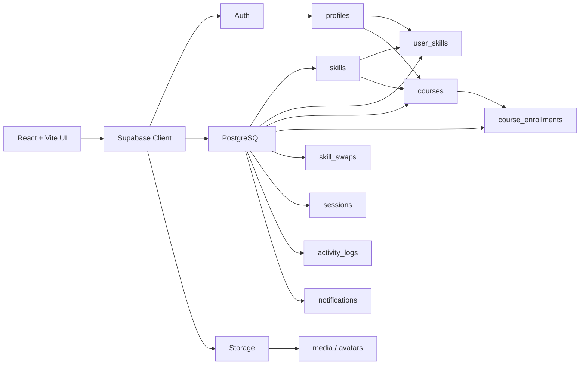

<div align="center">


<br />

[](https://react.dev/)
[](https://vite.dev/)
[](https://tailwindcss.com/)
[](https://supabase.com/)
[](https://www.postgresql.org/)

**A modern platform for peer-to-peer learning, mentorship, course discovery and reciprocal skill exchange.**

</div>

---

## 01 · The idea

Traditional learning platforms usually have one direction:

> **Instructor → Student**

SkillSwap+ turns that into a network:

> **Learn ↔ Teach ↔ Swap ↔ Earn**

People can discover skills, teach what they know, learn what they need, create courses, exchange SS credits and build a visible learning history.

---

## 02 · Choose your mode

<table>
<tr>
<td width="33%" valign="top">

### 🎓 Learner

**Focus:** Learn

- Explore active courses
- Build learning interests
- Request enrollment
- Spend SS credits
- Track learning history

</td>
<td width="33%" valign="top">

### 🧑‍🏫 Mentor

**Focus:** Teach

- Maintain teaching skills
- Create courses
- Receive enrollments
- Earn SS credits
- Build teaching reputation

</td>
<td width="33%" valign="top">

### ⚡ Swap Master

**Focus:** Both

- Learn + teach
- Create courses
- Find reciprocal matches
- Exchange skills directly
- Earn swap rewards

</td>
</tr>
</table>

---

## 03 · Experience

```text
SIGN UP
   │
   ▼
PROFILE SETUP
   │
   ├── Learner ─────────► Learning Skills
   ├── Mentor ──────────► Teaching Skills
   └── Swap Master ─────► Teaching + Learning
                            │
                            ▼
                        DASHBOARD
                            │
          ┌─────────────────┼─────────────────┐
          ▼                 ▼                 ▼
      COURSES           SKILL SWAPS        HISTORY
          │                 │                 │
          ▼                 ▼                 ▼
      ENROLLMENT        MATCH / SWAP      ACTIVITY LOG
          │
          ▼
      SS TRANSFER
```

---

## 04 · What is already built

| Feature | Status |
|---|:---:|
| Authentication | ✅ |
| Profile setup | ✅ |
| Edit profile | ✅ |
| Avatar uploads | ✅ |
| Teaching / learning skills | ✅ |
| Role-based dashboard | ✅ |
| Course creation | ✅ |
| Course discovery | ✅ |
| Activity history | ✅ |
| Course details | 🚧 |
| Enrollment request | 🚧 |
| Instructor approval | 🚧 |
| Secure SS transfer | 🚧 |
| Notifications | 🚧 |
| Swap matching | 🚧 |
| Sessions & reviews | 🚧 |

---

## 05 · Course ecosystem

### Create

Only **Mentors** and **Swap Masters** can create courses, and only for skills they teach.

### Publish

```text
Pending
   │
   ▼
Admin Review
   │
   ├──► Active ───────► Visible in Course Discovery
   │
   └──► Suspended ────► Hidden from Discovery
```

### Discover

Users can search and filter courses by:

`Title` · `Skill` · `Instructor` · `Price` · `Level`

Levels:

`Beginner` · `Intermediate` · `Advanced`

Prices:

`50 SS` · `100 SS`

---

## 06 · SS economy

**SS** is the platform's internal value unit.

```text
Learner       ── SS ──► Mentor
Learner       ── SS ──► Swap Master
Swap Master   ── SS ──► Mentor
Swap Master   ── SS ──► Swap Master
```

Credits are designed to move through secure server-side operations, not direct client-side balance edits.

> Course payment happens after a valid enrollment is approved.

---

## 07 · Reciprocal skill swap

A perfect Swap Master match looks like this:

```text
┌────────────────────────┐       ┌────────────────────────┐
│ USER A                 │       │ USER B                 │
│                        │       │                        │
│ Teaches: React         │◄─────►│ Teaches: UI/UX        │
│ Wants:   UI/UX         │       │ Wants:   React        │
└────────────────────────┘       └────────────────────────┘

                BOTH CONFIRM COMPLETION
                         │
                         ▼
                    SWAP REWARD
```

---

## 08 · Architecture



---

## 09 · Stack

<div align="center">


</div>

<br />

**Frontend**  
React · Vite · Tailwind CSS · React Router · Lucide React

**Backend**  
Supabase Auth · PostgreSQL · Row Level Security · PostgreSQL RPC · Supabase Storage

**Deployment**  
Netlify / Vercel compatible

---

## 10 · Database map

<details>
<summary><b>Open database areas</b></summary>

<br />

| Domain | Tables |
|---|---|
| Identity | `profiles` |
| Skills | `skills`, `skill_categories`, `user_skills`, `user_interests` |
| Courses | `courses`, `course_enrollments` |
| Credits | `credit_transactions` |
| Swaps | `skill_swaps` |
| Sessions | `sessions`, `session_participants` |
| Messaging | `conversations`, `conversation_members`, `messages`, `message_attachments` |
| Reviews | `reviews`, `review_reports` |
| History | `activity_logs` |
| Notifications | `notifications`, `notification_preferences` |
| Media | `media` |

</details>

---

## 11 · Security first

SkillSwap+ uses Supabase **Row Level Security** and PostgreSQL functions for sensitive flows.

```text
✓ Users update their own profiles
✓ Users manage their own skill selections
✓ Activity history is private per user
✓ Only valid instructors create courses
✓ Discovery exposes Active courses only
✓ Credit transfers should be atomic server-side operations
```

Google authentication is designed as **login-only for existing SkillSwap+ accounts**. Registration remains email/password based.

---

## 12 · Run locally

```bash
git clone <your-repository-url>
cd <your-project-folder>

npm install
```

Create `.env`:

```env
VITE_SUPABASE_URL=your_supabase_project_url
VITE_SUPABASE_PUBLISHABLE_KEY=your_supabase_publishable_key
```

Start:

```bash
npm run dev
```

> Never commit service-role keys, private credentials or production secrets.

---

## 13 · Project structure

```text
src/
├── components/
│   ├── DashboardCourses.jsx
│   ├── EditProfileHeader.jsx
│   ├── ProfileEditTab.jsx
│   ├── TeachingEditTab.jsx
│   ├── LearningEditTab.jsx
│   └── PreferencesEditTab.jsx
│
├── pages/
│   ├── Dashboard.jsx
│   ├── EditProfile.jsx
│   ├── History.jsx
│   ├── Courses.jsx
│   └── CourseCreation.jsx
│
└── lib/
    ├── supabase.js
    └── activityLog.js
```

---

## 14 · Design language

| Token | Value |
|---|---|
| Background | `#060807` |
| Surface | `#0A0D0B` |
| Text | `#F2F4EF` |
| Secondary | `#A1A1AA` |
| Accent | `#C7FF39` |

**Direction:** dark · minimal · sharp typography · subtle glow · thin borders · high contrast · low visual noise

---

## 15 · Next

```text
Course Discovery
      │
      ▼
Course Details
      │
      ▼
Enrollment Request
      │
      ▼
Instructor Approval
      │
      ▼
Secure SS Transfer
      │
      ▼
Course Completion
```

After that:

`Notifications` → `Swap Matching` → `Sessions` → `Reviews` → `Recommendations`

---

<div align="center">

### Built around one simple idea

## **What you know can help someone. What they know can help you.**

**SkillSwap+**

`LEARN  /  TEACH  /  SWAP  /  GROW`

</div>
