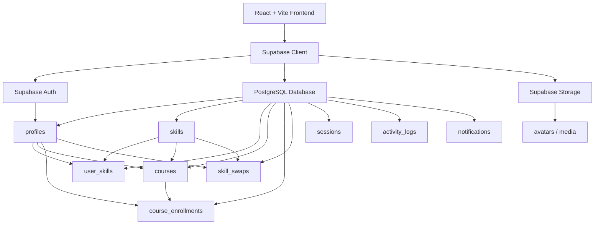
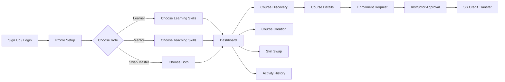

<div align="center">

# ⚡ SkillSwap+

### Learn. Teach. Swap. Grow.

A modern peer-to-peer skill exchange platform where people can **learn skills, teach what they know, create courses, exchange SS credits, and build a learning network**.

<br />


<br />

> **SkillSwap+ turns knowledge into a two-way economy — users can learn, teach, swap skills, and earn value through participation.**

</div>

---

## ✦ Overview

**SkillSwap+** is a role-based learning and mentorship platform built for skill exchange.

Instead of relying only on traditional paid courses, users can participate in a community where skills become a form of value. A user may learn from others, teach their own expertise, create structured courses, request skill swaps, and track their activity over time.

The platform currently supports three main roles:

| Role | Learn | Teach | Create Courses | Skill Swap |
|---|:---:|:---:|:---:|:---:|
| **Learner** | ✅ | ❌ | ❌ | ❌ |
| **Mentor** | ❌ | ✅ | ✅ | ❌ |
| **Swap Master** | ✅ | ✅ | ✅ | ✅ |

---

## 🚀 Core Features

### 👤 Authentication & Profiles

- Email/password registration
- Secure Supabase authentication
- Google sign-in for **existing registered accounts**
- Role-based profiles
- Avatar upload and previous-avatar history
- Bio, career goal, location, username and profile preferences
- Profile completion flow

### 🧠 Skills

Users can maintain two separate skill sets:

- **Teaching skills**
- **Learning skills**

A **Swap Master** can maintain both at the same time.

### 🎓 Course System

Mentors and Swap Masters can create courses based on skills they teach.

Courses include:

- Course title
- Skill
- Level: Beginner / Intermediate / Advanced
- SS credit price: 50 SS / 100 SS
- Instructor
- Course status

Course lifecycle:

```text
Course Created
      │
      ▼
   Pending
      │
      ▼
 Admin Review
   ┌──┴──────────┐
   ▼             ▼
 Active       Suspended
   │
   ▼
Visible in Course Discovery
```

### 🔎 Course Discovery

Users can browse active courses and filter by:

- Course title
- Skill
- Instructor
- Price
- Course level

Course Discovery only displays courses with:

```text
status = Active
```

### 💳 SS Credit Economy

SkillSwap+ uses an internal credit system called **SS**.

```text
Learner ────── SS ──────► Mentor
Learner ────── SS ──────► Swap Master
Swap Master ── SS ──────► Mentor
Swap Master ── SS ──────► Swap Master
```

Course payments are designed to happen only after a valid enrollment request is approved.

### 🔄 Skill Swaps

Swap Masters can exchange skills directly.

```text
User A
Teaches: Front-End Development
Wants: Product Design

          ⇅  SKILL SWAP  ⇅

User B
Teaches: Product Design
Wants: Front-End Development
```

A successful reciprocal swap can reward both users with SS credits after both sides confirm completion.

### 🕘 Activity History

SkillSwap+ records meaningful user actions in a private activity history.

Examples:

```text
Profile updated
Avatar updated
Teaching skill added
Teaching skill removed
Learning skill added
Learning skill removed
Course created
Enrollment requested
Swap completed
Session completed
Review submitted
```

Each user only sees their own history.

---

## 🧩 System Architecture



---

## 🛠 Tech Stack

### Frontend

- **React**
- **Vite**
- **Tailwind CSS**
- **React Router**
- **Lucide React**

### Backend

- **Supabase**
- **PostgreSQL**
- **Row Level Security**
- **PostgreSQL RPC functions**
- **Supabase Auth**
- **Supabase Storage**

### Deployment

The frontend is compatible with platforms such as:

- **Netlify**
- **Vercel**

---

## 🗃 Main Database Areas

| Area | Main Tables |
|---|---|
| Users | `profiles` |
| Skills | `skills`, `skill_categories`, `user_skills`, `user_interests` |
| Courses | `courses`, `course_enrollments` |
| Credits | `credit_transactions`, credit-related account data |
| Skill Swap | `skill_swaps` |
| Sessions | `sessions`, `session_participants` |
| Messaging | `conversations`, `conversation_members`, `messages`, `message_attachments` |
| Reviews | `reviews`, `review_reports` |
| Activity | `activity_logs` |
| Notifications | `notifications`, `notification_preferences` |
| Media | `media` |

---

## 📁 Core Frontend Structure

```text
src/
│
├── components/
│   ├── DashboardCourses.jsx
│   ├── EditProfileHeader.jsx
│   ├── ProfileEditTab.jsx
│   ├── TeachingEditTab.jsx
│   ├── LearningEditTab.jsx
│   └── PreferencesEditTab.jsx
│
├── pages/
│   ├── Dashboard.jsx
│   ├── EditProfile.jsx
│   ├── History.jsx
│   ├── Courses.jsx
│   └── CourseCreation.jsx
│
├── lib/
│   ├── supabase.js
│   └── activityLog.js
│
└── ...
```

---

## ⚙️ Local Setup

### 1. Clone the repository

```bash
git clone <your-repository-url>
cd <your-project-folder>
```

### 2. Install dependencies

```bash
npm install
```

### 3. Create your environment file

Create:

```text
.env
```

Add:

```env
VITE_SUPABASE_URL=your_supabase_project_url
VITE_SUPABASE_PUBLISHABLE_KEY=your_supabase_publishable_key
```

> Never commit private or service-role keys to the repository.

### 4. Start development

```bash
npm run dev
```

Then open the local URL shown by Vite.

---

## 🔐 Security Model

SkillSwap+ uses **Supabase Row Level Security (RLS)** to protect user data.

- Users can update their own profiles
- Users can manage their own skill selections
- Users only see their own private activity history
- Only valid instructors can create courses
- Course Discovery exposes only active courses
- Sensitive credit operations should be handled through secure PostgreSQL functions instead of direct client-side balance updates

---

## 🧭 Main User Flow



---

## 🧪 Course Status Rules

**Pending** — course has been created but is waiting for admin review.

**Active** — course is approved/published and visible in Course Discovery.

**Suspended** — course is disabled and hidden from normal discovery.

---

## 📚 Enrollment Status Rules

```text
Pending
   │
   ├──► Approved
   │       │
   │       └──► Completed
   │
   ├──► Rejected
   │
   └──► Cancelled
```

Course status and enrollment status are intentionally separate.

---

## 🧱 Design Direction

SkillSwap+ uses a dark, minimal interface with a high-contrast lime accent.

```text
Background       #060807
Surface          #0A0D0B
Secondary        #A1A1AA
Primary Text     #F2F4EF
Accent           #C7FF39
```

The interface focuses on:

- Strong typography
- Minimal visual noise
- Clear hierarchy
- Responsive cards
- Subtle borders
- Soft glow effects
- Fast navigation
- Consistent interaction states

---

## 🗺 Roadmap

- [x] Authentication
- [x] Profile setup
- [x] Edit profile
- [x] Teaching and learning skills
- [x] Role-based dashboard
- [x] Course creation
- [x] Course discovery
- [x] Activity history
- [ ] Course details
- [ ] Enrollment request flow
- [ ] Instructor enrollment approval
- [ ] Secure SS credit transfer
- [ ] Course completion
- [ ] Notifications
- [ ] Swap Master matching
- [ ] Skill swap request flow
- [ ] Swap completion rewards
- [ ] Session scheduling
- [ ] Reviews and reputation
- [ ] Recommendation system

---

## 💡 Product Vision

> **Everyone has something to learn and something valuable to teach.**

The goal is to create an ecosystem where learning is collaborative, skills are discoverable, mentorship is accessible, and knowledge can move directly between people.

---

## 🤝 Contributing

```bash
git checkout -b feature/your-feature
git add .
git commit -m "Add your feature"
git push origin feature/your-feature
```

Then open a pull request for review.

---

## 📌 Development Notes

Before merging a feature:

- Check Supabase RLS policies
- Verify role restrictions
- Test authenticated and unauthenticated states
- Test empty states
- Test mobile layout
- Check browser console errors
- Never expose secret Supabase keys
- Keep important transactions server-side and atomic

---

<div align="center">

### Built for people who want to learn by sharing what they know.

**SkillSwap+**

`Learn • Teach • Swap • Grow`

</div>

